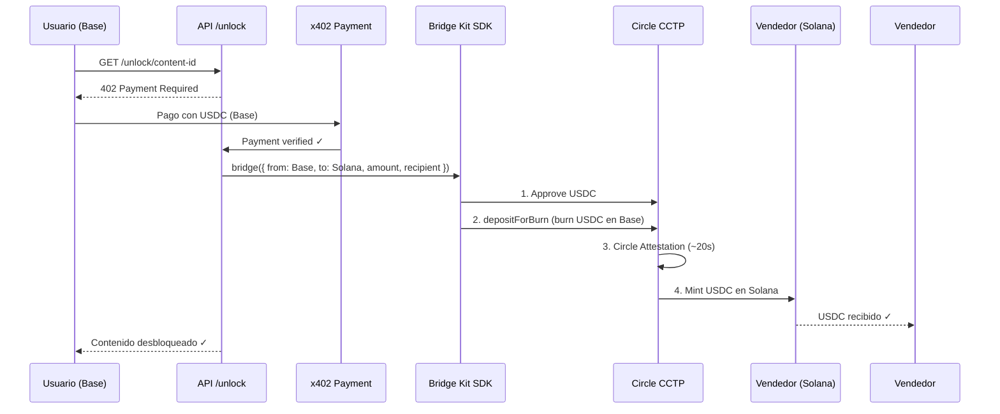

# x402 Multi-Chain Unlock

Sistema de desbloqueo de contenido con pago en USDC desde **Base** o **Solana**, con bridge automático usando **CCTP** si es necesario.

## Flujo

```
Usuario quiere desbloquear contenido
         ↓
   Conecta con Gmail (Privy)
         ↓
   Privy crea wallets: Base + Solana
         ↓
   Sistema detecta saldo USDC en ambas redes
         ↓
┌────────────────────────────────────────┐
│ ¿Tiene saldo suficiente en alguna red? │
└────────────────────────────────────────┘
         ↓
   SI → Paga directamente con x402
         ↓
   NO pero saldo combinado alcanza
         ↓
   Bridge automático CCTP (Solana↔Base)
         ↓
   Paga con x402
         ↓
   Contenido desbloqueado ✓
```

## Tecnologías

| Componente | Tecnología |
|------------|------------|
| Auth & Wallets | Privy (Gmail → wallets EVM + Solana) |
| Pagos | x402 (HTTP 402 Payment Required) |
| Bridge | **Circle Bridge Kit SDK** (CCTP V2) |
| Backend Wallet | Coinbase CDP SDK (Server Wallets) |
| Frontend | Next.js 14 + Tailwind |
| Networks | Base Mainnet + Solana Mainnet |

### Bridge Kit SDK (Oficial de Circle)

Este proyecto usa el **Circle Bridge Kit SDK** oficial para bridges CCTP, siguiendo las mejores prácticas de Circle:

- ✅ `@circle-fin/bridge-kit` - SDK principal para bridges
- ✅ `@circle-fin/adapter-viem-v2` - Adapter para EVM chains (Base)
- ✅ `@circle-fin/adapter-solana` - Adapter para Solana
- ✅ Soporte para Fast Transfer (< 30 segundos)
- ✅ Manejo automático de burn, attestation y mint

## Setup

```bash
# 1. Instalar dependencias
npm install

# 2. Configurar variables de entorno
cp .env.example .env.local
# Editar .env.local con tus credenciales (ver abajo)

# 3. Ejecutar
npm run dev
```

### Variables de Entorno Requeridas

Crea un archivo `.env.local` con las siguientes variables:

```bash
# Privy (Auth & Wallets)
# https://dashboard.privy.io
NEXT_PUBLIC_PRIVY_APP_ID=your_privy_app_id

# CDP (Coinbase Developer Platform)
# https://portal.cdp.coinbase.com
CDP_API_KEY=your_cdp_api_key
CDP_API_SECRET=your_cdp_api_secret

# Facilitator Wallet Keys
# IMPORTANTE: El facilitator recibe pagos y ejecuta bridges
# Necesitas una wallet con:
# - USDC en Base para recibir pagos
# - ETH en Base para gas fees (~0.001 ETH)
# - Private key en formato hex (0x...)

# Private key de la wallet facilitator (Base/EVM)
FACILITATOR_PRIVATE_KEY=0x1234567890abcdef...

# Private key de una wallet Solana (para Bridge Kit adapter)
# Puede ser cualquier wallet Solana válida
# Formato: Base58 o hex
SOLANA_PRIVATE_KEY=your_solana_private_key_base58

# Opcional: Address del agente CDP (si ya tienes uno)
CDP_AGENT_ADDRESS=0x...
```

### Configuración del Facilitator

El **facilitator** es la wallet que:
1. ✅ Recibe pagos x402 en Base
2. ✅ Ejecuta bridges CCTP cuando el vendedor está en Solana
3. ✅ Necesita gas (ETH) para ejecutar transacciones

**Fondos necesarios:**
```bash
# En Base Mainnet:
- Mínimo 0.001 ETH (para gas)
- USDC (para recibir pagos)

# Obtener la address del facilitator:
# La address se deriva de FACILITATOR_PRIVATE_KEY
# Puedes usar: https://www.ethereumaddressfromkey.com/
```

**Cómo obtener una private key:**
```bash
# Opción 1: Crear con cast (Foundry)
cast wallet new

# Opción 2: Exportar desde MetaMask
# MetaMask → Account Details → Export Private Key
```

## Estructura

```
src/
├── app/
│   ├── api/
│   │   ├── unlock/[contentId]/route.ts  # x402 endpoint + bridge automático
│   │   └── facilitator/route.ts         # Info del facilitator
│   ├── layout.tsx
│   ├── page.tsx                          # Demo UI
│   └── providers.tsx                     # Privy Provider
├── components/
│   └── ContentUnlock.tsx                 # Componente principal
├── hooks/
│   └── useMultiChainBalance.ts           # Hook para balances
└── lib/
    ├── balance.ts                        # Consulta USDC Base + Solana
    ├── cdp/
    │   └── server-wallet.ts              # Bridge con Circle Bridge Kit SDK
    ├── cctp/
    │   ├── constants.ts                  # Contratos CCTP
    │   └── bridge.ts                     # Bridge utilities (legacy)
    └── x402/
        └── payment.ts                    # x402 payment utilities
```

## Flujo del Bridge (Circle Bridge Kit SDK)

Cuando un usuario paga en Base pero el vendedor está en Solana, se ejecuta automáticamente:



### Ventajas del Bridge Kit SDK

✅ **Todo automatizado** - Una sola llamada `kit.bridge()`  
✅ **Fast Transfer** - Attestation en ~20-30 segundos  
✅ **Manejo de errores** - Reintentos automáticos  
✅ **Type-safe** - TypeScript completo  
✅ **Multi-chain** - Soporta Base, Ethereum, Arbitrum, Optimism, Polygon, Solana, etc.

## CCTP Contratos

### Base (Domain 6)
| Contrato | Dirección |
|----------|-----------|
| TokenMessenger | `0x28b5a0e9C621a5BadaA536219b3a228C8168cf5d` |
| MessageTransmitter | `0x81D40F21F12A8F0E3252Bccb954D722d4c464B64` |
| USDC | `0x833589fCD6eDb6E08f4c7C32D4f71b54bdA02913` |

### Solana (Domain 5)
| Programa | Address |
|----------|---------|
| MessageTransmitter | `CCTPmbSD7gX1bxKPAmg77w8oFzNFpaQiQUWD43TKaecd` |
| TokenMessengerMinter | `CCTPiPYPc6AsJuwueEnWgSgucamXDZwBd53dQ11YiKX3` |
| USDC | `EPjFWdd5AufqSSqeM2qN1xzybapC8G4wEGGkZwyTDt1v` |

## Uso

### Componente ContentUnlock

```tsx
import { ContentUnlock } from "@/components/ContentUnlock";

<ContentUnlock
  contentId="premium-track"
  title="Track Premium"
  description="Paga con USDC desde Base o Solana"
  price="$0.10"
  onUnlocked={(content) => console.log(content)}
/>
```

### Hook useMultiChainBalance

```tsx
import { useMultiChainBalance } from "@/hooks/useMultiChainBalance";

function MyComponent() {
  const { 
    balances,           // { base, solana, totalUsdc, preferredNetwork }
    isLoading,
    checkAffordability, // (price) => { canPay, payWith, needsBridge }
    refetch,
  } = useMultiChainBalance();

  const affordability = checkAffordability("$1.00");
  
  if (affordability.needsBridge) {
    // Bridge required from affordability.bridgeFrom to affordability.bridgeTo
  }
}
```

## API Endpoint Protegido

```typescript
// GET /api/unlock/[contentId]
// Sin pago → 402 Payment Required
// Con pago válido → Contenido

// Response 402:
{
  "error": "Payment Required",
  "paymentRequirements": {
    "x402Version": 1,
    "scheme": "exact",
    "network": "base-sepolia",
    "maxAmountRequired": "0.10",
    "payTo": "0x...",
    "asset": "USDC"
  }
}
```

## Recursos

- [x402 Docs](https://docs.cdp.coinbase.com/x402)
- [Circle CCTP](https://developers.circle.com/cctp)
- [Privy Docs](https://docs.privy.io)
